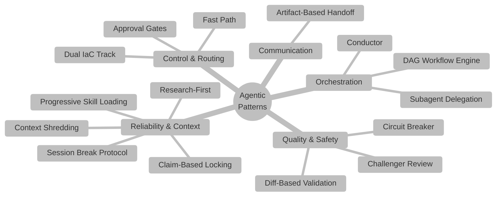

# :material-puzzle-outline: Agentic Patterns

This page catalogs every agentic design pattern used in Agentic InfraOps.
Each pattern has a **category**, a concise description of the **problem** it solves,
and a pointer to where it is implemented.

!!! info "Patterns at a Glance"

    The system combines 15 distinct agentic patterns drawn from
    [Harness Engineering](index.md#harness-engineering-openai),
    [Bosun](index.md#bosun-virtengine),
    and [Ralph](index.md#ralph-snarktank). Together they make agent-generated
    Azure infrastructure reliable, resumable, and cost-governed.

## :material-view-grid-outline: Pattern Catalog

| # | Pattern | Category | Purpose |
|---|---------|----------|---------|
| 1 | [Conductor / Orchestrator](#1-conductor--orchestrator-pattern) | Orchestration | Route work; never do the work |
| 2 | [Subagent Delegation](#2-subagent-delegation-pattern) | Orchestration | Isolate expensive tasks |
| 3 | [Artifact-Based Handoff](#3-artifact-based-handoff-pattern) | Communication | Files as the message bus |
| 4 | [Challenger / Adversarial Review](#4-challenger--adversarial-review-pattern) | Quality | Independent adversarial lens |
| 5 | [Human-in-the-Loop Approval Gates](#5-human-in-the-loop-approval-gates) | Control | Human sign-off at risk points |
| 6 | [Dual IaC Track (Fan-Out)](#6-dual-iac-track-fan-out-pattern) | Routing | Single input, parallel IaC outputs |
| 7 | [Fast Path](#7-fast-path-pattern) | Routing | Short-circuit for simple workloads |
| 8 | [Research-First](#8-research-first-pattern) | Reliability | Gather context before acting |
| 9 | [Progressive Skill Loading](#9-progressive-skill-loading-pattern) | Context | On-demand deep knowledge |
| 10 | [Context Shredding (3-Tier Compression)](#10-context-shredding-pattern) | Context | Tiered artefact compression |
| 11 | [Session Break Protocol](#11-session-break-protocol) | Reliability | Fresh context at natural checkpoints |
| 12 | [Claim-Based Locking](#12-claim-based-locking-pattern) | Concurrency | Prevent concurrent state corruption |
| 13 | [DAG Workflow Engine](#13-dag-workflow-engine-pattern) | Orchestration | Machine-readable step sequencing |
| 14 | [Circuit Breaker](#14-circuit-breaker-pattern) | Safety | Halt runaway agent loops |
| 15 | [Diff-Based Validation](#15-diff-based-validation-pattern) | Quality | Run only relevant validators |

---

## Orchestration Patterns

### 1. Conductor / Orchestrator Pattern

**Category**: Orchestration
**Source**: Bosun `workflow-engine.mjs` + Harness Engineering "structured step progression"

**Problem**: A single agent handling all 8 workflow steps would accumulate too much
context, making decisions with stale information from steps completed hours earlier.

**Solution**: The InfraOps Conductor (`01-Conductor`) is a pure state machine.
It reads `workflow-graph.json`, resolves the correct agent from `agent-registry.json`,
delegates each step via `#runSubagent`, enforces approval gates, and maintains
`00-session-state.json`. It **never** writes infrastructure templates or documentation
itself — it only routes.

**Where implemented**:

- Agent definition: `.github/agents/01-conductor.agent.md`
- Workflow graph: `.github/skills/workflow-engine/templates/workflow-graph.json`
- Agent registry: `.github/agent-registry.json`

[:octicons-arrow-right-24: System Architecture → Conductor Pattern](architecture.md#the-conductor-pattern)

---

### 2. Subagent Delegation Pattern

**Category**: Orchestration
**Source**: Bosun distributed executor model + Harness Engineering context isolation

**Problem**: Some tasks (policy discovery, adversarial review, lint validation) are
expensive, domain-specific, and would bloat the parent agent's context window if run
inline.

**Solution**: Parent agents delegate to purpose-built subagents via `#runSubagent`.
Subagents are `user-invocable: false`, carry only the tools they need, and return
structured verdicts (`PASS`/`FAIL`, `APPROVED`/`NEEDS_REVISION`). The parent
reads only the verdict, not the full intermediate work.

**11 subagents in the system**:

| Subagent | Parent | Purpose |
|----------|--------|---------|
| `challenger-review-subagent` | All step agents | Adversarial review |
| `challenger-review-batch-subagent` | Steps 2, 4, 5 | Batched multi-lens review |
| `challenger-review-codex-subagent` | Steps 2, 4 | Fast Codex-model review |
| `cost-estimate-subagent` | Step 2 | Azure Pricing MCP queries |
| `governance-discovery-subagent` | Steps 4b, 4t | Azure Policy REST API |
| `bicep-lint-subagent` | Step 5b | `bicep build` + `bicep lint` |
| `bicep-review-subagent` | Step 5b | AVM/security code review |
| `bicep-whatif-subagent` | Step 6b | `az deployment what-if` |
| `terraform-lint-subagent` | Step 5t | `terraform fmt` + `validate` |
| `terraform-review-subagent` | Step 5t | AVM-TF code review |
| `terraform-plan-subagent` | Step 6t | `terraform plan` preview |

**Where implemented**: `.github/agents/_subagents/`

[:octicons-arrow-right-24: Agent Architecture → Subagents](agents.md#subagents-11)

---

### 13. DAG Workflow Engine Pattern

**Category**: Orchestration
**Source**: Bosun `workflow-engine.mjs` + `workflow-nodes.mjs`

**Problem**: A hardcoded sequential script cannot handle conditional IaC routing,
optional steps, or resume-from-checkpoint.

**Solution**: The 8-step pipeline is encoded as a machine-readable directed acyclic
graph in `workflow-graph.json`. Each node has a type
(`agent-step`, `gate`, `subagent-fan-out`, `validation`), and each edge has a
condition (`on_complete`, `on_skip`, `on_fail`). The Conductor reads this graph at
runtime to determine the next step, skippable nodes, and required approvals.

**Node types**:

| Type | Example | Behaviour |
|------|---------|-----------|
| `agent-step` | Requirements, Architecture | Delegate to a named agent |
| `gate` | Gates 1–5 | Pause until condition met |
| `subagent-fan-out` | Challenger review | Spawn multiple subagents in parallel |
| `validation` | Gate 4 | Run automated checks |

**Where implemented**:
`.github/skills/workflow-engine/templates/workflow-graph.json`

[:octicons-arrow-right-24: Workflow Engine → DAG Model](workflow-engine.md#the-dag-model)

---

## Communication Patterns

### 3. Artifact-Based Handoff Pattern

**Category**: Communication
**Source**: Harness Engineering "repo is system of record" + Ralph append-only artefacts

**Problem**: Direct message passing between agents leaks context, prevents resume,
and makes human review difficult.

**Solution**: Agents communicate exclusively through versioned artefact files in
`agent-output/{project}/`. Each step produces a markdown document that the next
step reads as input. No direct agent-to-agent messages exist. At each approval gate
the Conductor writes a `00-handoff.md` summary and updates `00-session-state.json`.

**Benefits**:

- **Resume from any point** — artefacts are persistent, not ephemeral chat messages
- **Human-readable** — operators can inspect every decision at every step
- **Context isolation** — each agent starts clean with only the artefacts it needs
- **Auditability** — the full decision trail lives in git history

**Where implemented**: `agent-output/{project}/` (runtime), agent definitions

[:octicons-arrow-right-24: Agent Architecture → Handoffs and Delegation](agents.md#handoffs-and-delegation)

---

## Quality and Safety Patterns

### 4. Challenger / Adversarial Review Pattern

**Category**: Quality
**Source**: Harness Engineering "enforce invariants" + independent review practices

**Problem**: The agent that generated an artefact cannot objectively critique it —
it will rationalise its own choices.

**Solution**: A dedicated `challenger-review-subagent` (using a different model tier)
reviews artefacts with rotating lenses. It operates independently, with no access to
the original agent's reasoning. Findings are classified as `must_fix` (blocking) or
`should_fix` (advisory).

**Review schedule**:

| Step | Passes | Lenses |
|------|--------|--------|
| 1 — Requirements | 1 | Comprehensive |
| 2 — Architecture | 3 (+1 final) | Security, Reliability, Cost |
| 4 — IaC Plan | 1 + 3 | Comprehensive + rotating |
| 5 — IaC Code | 3 | Security, WAF, Governance |
| 6 — Deploy | 1 | Comprehensive |

**Conditional Pass 3**: Pass 3 only runs if Pass 2 returned ≥ 1 `must_fix` finding,
saving approximately 4 minutes per review cycle when code is clean.

**Where implemented**: `.github/agents/_subagents/challenger-review-subagent.agent.md`

[:octicons-arrow-right-24: Agent Architecture → Challenger Pattern](agents.md#the-challenger-pattern)

---

### 14. Circuit Breaker Pattern

**Category**: Safety
**Source**: Bosun `anomaly-detector.mjs` + `error-detector.mjs`

**Problem**: An agent in a failure loop (repeated errors, auth failures, empty
responses) can consume quota, corrupt state, and block the workflow indefinitely.

**Solution**: The circuit breaker monitors for anomaly signatures and halts the
agent after a threshold is crossed. Each anomaly type has a detection count and
a mandatory action.

| Anomaly | Threshold | Action |
|---------|-----------|--------|
| Error repetition | 3 consecutive | Halt, write `blocked` finding |
| Empty response loop | 3 consecutive | Halt, escalate to human |
| Timeout cascade | 3 consecutive | Halt, check auth |
| What-if oscillation | 2 cycles | Halt, flag resource conflict |
| Auth failure loop | 2 consecutive | Halt, prompt re-authentication |

**Where implemented**:
`.github/skills/iac-common/references/circuit-breaker.md`

[:octicons-arrow-right-24: Workflow Engine → Circuit Breaker](workflow-engine.md#circuit-breaker)

---

### 15. Diff-Based Validation Pattern

**Category**: Quality
**Source**: Bosun `.githooks/` diff-based targeted validation

**Problem**: Running the full 28-validator suite on every push is slow and discourages
frequent commits.

**Solution**: The `diff-based-push-check.sh` pre-push hook categorises changed files
by domain and runs only matching validators in parallel.

| Changed File Pattern | Validators Run |
|---------------------|----------------|
| `*.bicep` | Bicep build + lint |
| `*.tf` | Terraform fmt + validate |
| `*.agent.md` | Agent frontmatter + body size |
| `*.instructions.md` | Instruction frontmatter |
| `SKILL.md` | Skills format + skill size |
| `*.json` | JSON syntax |
| `*.py` | Ruff lint |

**Where implemented**: `lefthook.yml`, `.github/hooks/`

[:octicons-arrow-right-24: Workflow Engine → Git Hooks](workflow-engine.md#git-hooks-pre-commit-and-pre-push)

---

## Control and Routing Patterns

### 5. Human-in-the-Loop Approval Gates

**Category**: Control
**Source**: Harness Engineering "human taste gets encoded" + Bosun mandatory review gates

**Problem**: Fully autonomous infrastructure deployment without human review is
unsafe — mistakes in a requirements document compound through all subsequent steps.

**Solution**: Five mandatory gates pause the workflow until a human explicitly
approves progression. The Conductor cannot advance to the next step until the gate
condition is met.

| Gate | After Step | Condition |
|------|------------|-----------|
| 1 | Requirements | Human approves requirements |
| 2 | Architecture | Human approves architecture + cost estimate |
| 2.5 | Governance | Human approves governance constraints |
| 3 | IaC Plan | Human approves implementation plan |
| 4 | IaC Code | Automated validation passes |
| 5 | Deploy | Human approves deployment |

**Where implemented**: `workflow-graph.json` gate nodes, Conductor agent logic

[:octicons-arrow-right-24: Workflow Engine → Gates and Approval Points](workflow-engine.md#gates-and-approval-points)

---

### 6. Dual IaC Track (Fan-Out) Pattern

**Category**: Routing
**Source**: Project-specific pattern for Bicep / Terraform parity

**Problem**: The system must support both Azure Bicep and Terraform without
duplicating the requirements, architecture, and governance steps.

**Solution**: Steps 1–3.5 are shared across both tracks. At Step 4 the workflow
fans out based on the `iac_tool` field in `01-requirements.md`. The Bicep track
(steps 4b → 5b → 6b) and Terraform track (steps 4t → 5t → 6t) run
independently, converging again at Step 7 (As-Built documentation).

```text
Steps 1–3.5 (Shared)
        │
        ▼
  iac_tool = ?
  ┌──────┴──────┐
  ▼             ▼
Bicep       Terraform
4b→5b→6b   4t→5t→6t
  └──────┬──────┘
         ▼
    Step 7 (Shared)
```

**Where implemented**: `workflow-graph.json` conditional edges,
`agent-registry.json` track routing

[:octicons-arrow-right-24: System Architecture → Dual IaC Tracks](architecture.md#dual-iac-tracks)

---

### 7. Fast Path Pattern

**Category**: Routing
**Source**: Project-specific optimisation for simple workloads

**Problem**: Running the full 8-step workflow for a workload of ≤ 3 resources
wastes time and introduces unnecessary approval overhead.

**Solution**: The `01-Conductor (Fast Path)` agent detects simple workloads
(≤ 3 resources, no governance requirements, no complex networking) and routes them
through a compressed 4-step path: Requirements → Architecture → Code → Deploy.
The Conductor selects the fast path automatically based on the project description.

**Where implemented**: `.github/agents/01-conductor-fastpath.agent.md`

---

## Reliability Patterns

### 8. Research-First Pattern

**Category**: Reliability
**Source**: Harness Engineering "parse at boundaries"

**Problem**: Agents that generate output without first understanding the context
produce artefacts that fail governance checks, reference unavailable AVM modules,
or contradict prior step decisions.

**Solution**: Every agent is required to reach 80 % confidence before producing
output. The mandatory pre-implementation checklist:

- [ ] Search workspace for existing patterns and prior step artefacts
- [ ] Read relevant templates from `.github/skills/azure-artifacts/templates/`
- [ ] Query Azure documentation via MCP tools (Microsoft Learn, Azure docs)
- [ ] Validate all required inputs from previous steps exist
- [ ] Check shared defaults in `azure-defaults/SKILL.md`

For expensive research (governance discovery, cost estimation), the parent agent
delegates to a research subagent and waits for the structured result.

**Where implemented**: `.github/instructions/agent-research-first.instructions.md`

[:octicons-arrow-right-24: Skills & Instructions → Instruction System](skills-and-instructions.md)

---

### 11. Session Break Protocol

**Category**: Reliability
**Source**: Bosun `shared-state-manager.mjs` + Ralph fresh-context iteration model

**Problem**: Long-running Copilot Chat sessions (3+ hours) experience forced
context summarisations that silently discard critical decision context —
real-world testing found 5 summarisations in a single 3h39m session.

**Solution**: At Gates 2 and 3 the Conductor writes `00-handoff.md` + updates
`00-session-state.json`, then recommends the user start a fresh chat session.
The new session resumes from the checkpoint by reading the state file —
no context from the old session is needed.

**Protocol steps**:

1. Conductor writes current state to `00-session-state.json`
2. Conductor writes `00-handoff.md` with human-readable summary
3. Conductor prints "SESSION BREAK RECOMMENDED" with resume instructions
4. User starts a new chat, invokes Conductor
5. Conductor reads state file, finds next pending step, resumes

**Where implemented**: Conductor agent body, `session-resume` skill

[:octicons-arrow-right-24: Workflow Engine → Session Break Protocol](workflow-engine.md#session-break-protocol)

---

### 12. Claim-Based Locking Pattern

**Category**: Concurrency
**Source**: Bosun `shared-state-manager.mjs` heartbeat + claim tokens

**Problem**: Two Copilot sessions starting simultaneously for the same project
would both write to `00-session-state.json`, corrupting the workflow state.

**Solution**: The session state schema v2.0 implements claim-based locking.
Each active step holds a `claim` object with `owner_id`, `heartbeat`,
`attempt_token`, and `retry_count`. The Conductor checks the claim before
writing. Stale heartbeats (older than `stale_threshold_ms`, default 5 minutes)
are automatically recovered, allowing interrupted sessions to be taken over.

```json
{
  "lock": {
    "owner_id": "copilot-session-abc123",
    "heartbeat": "2026-03-04T10:15:00Z",
    "attempt_token": "550e8400-e29b-41d4-a716-446655440000"
  }
}
```

**Where implemented**: `00-session-state.json` schema, `session-resume` skill,
`validate:session-lock` validator

[:octicons-arrow-right-24: Workflow Engine → Session State and Resume](workflow-engine.md#session-state-and-resume)

---

## Context Management Patterns

### 9. Progressive Skill Loading Pattern

**Category**: Context
**Source**: Harness Engineering "context is scarce" + "progressive disclosure"

**Problem**: Loading all 20+ skills into every agent's context window at startup
consumes tokens before any task-specific work begins.

**Solution**: Skills implement three levels of disclosure.
Agents load only what they need, when they need it:

| Level | What Loads | When |
|-------|------------|------|
| 1 — `SKILL.md` | Compact overview (≤ 500 lines) | Agent reads the skill |
| 2 — `references/` | Detailed guides and lookup tables | Specific sub-task requires it |
| 3 — `templates/` | Exact structural skeletons | Output generation phase |

Skill affinity weights in `skill-affinity.json` further guide loading:
`primary` skills load at startup; `secondary` skills load on demand;
`never` skills are excluded from the agent's domain.

**Where implemented**: `.github/skill-affinity.json`,
`.github/instructions/context-optimization.instructions.md`

[:octicons-arrow-right-24: Skills & Instructions → Progressive Loading](skills-and-instructions.md#progressive-loading)

---

### 10. Context Shredding Pattern

**Category**: Context
**Source**: Bosun `context-shredding-config.mjs` tiered compression

**Problem**: As a session accumulates artefacts (requirements, architecture,
plan, code), loading them in full for review or documentation passes exhausts
the model context window.

**Solution**: The `context-shredding` skill defines three compression tiers.
Agents check current context usage before loading any artefact and select the
appropriate tier:

| Tier | Trigger | Strategy | Typical Reduction |
|------|---------|----------|------------------|
| `full` | < 60 % used | Load entire artefact | 0 % |
| `summarized` | 60–80 % | Key H2 sections only (tables preserved) | 40–60 % |
| `minimal` | > 80 % | Decision summary from session state | 60–70 % |

The Challenger subagent applies additional intelligence at the `summarized`
tier: it preserves only resource list, SKUs, WAF scores, compliance matrix,
and budget sections. After each review pass, only `compact_for_parent` is
carried forward — not the full JSON findings — preventing context bloat
across multi-pass reviews.

**Where implemented**: `.github/skills/context-shredding/SKILL.md`

[:octicons-arrow-right-24: Workflow Engine → Context Compression](workflow-engine.md#context-compression)

---

## Summary

The 15 patterns cluster into five concerns:



| Concern | Patterns | Primary Goal |
|---------|----------|--------------|
| Orchestration | Conductor, Subagent Delegation, DAG Engine | Route and decompose work |
| Communication | Artifact-Based Handoff | Persistent, resumable state |
| Quality & Safety | Challenger, Circuit Breaker, Diff Validation | Catch errors before they compound |
| Control & Routing | Approval Gates, Dual IaC, Fast Path | Human control + track selection |
| Reliability & Context | Research-First, Session Break, Locking, Skill Loading, Shredding | Stay accurate and within limits |

---

!!! tip "Further Reading"

    - [System Architecture](architecture.md) — Conductor pattern and 8-step workflow
    - [Agent Architecture](agents.md) — Subagents, Challenger pattern, and handoff design
    - [Workflow Engine & Quality](workflow-engine.md) — DAG model, session state, circuit breakers
    - [Skills & Instructions](skills-and-instructions.md) — Progressive loading and instruction enforcement
    - [Intellectual Foundations](index.md#intellectual-foundations) — Harness Engineering, Bosun, Ralph
